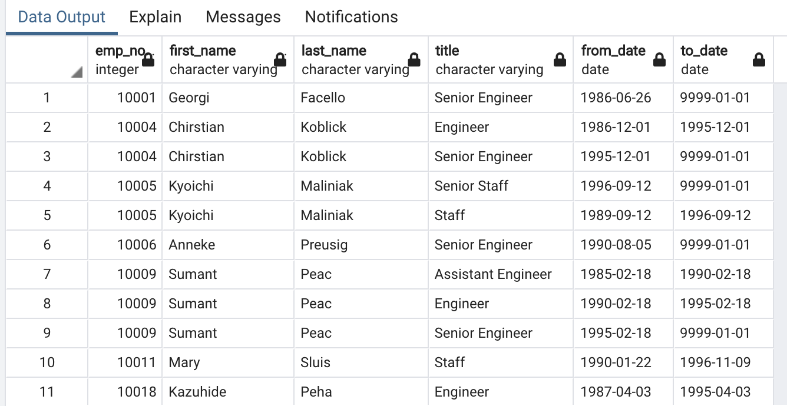
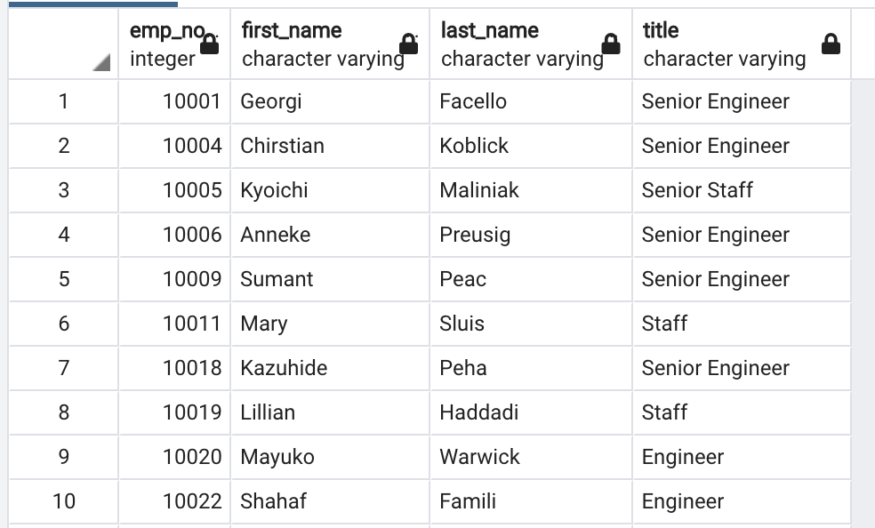
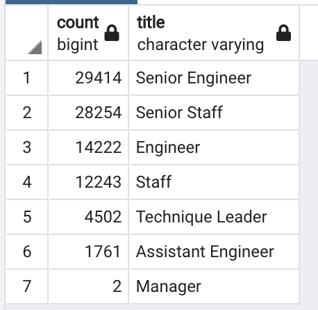
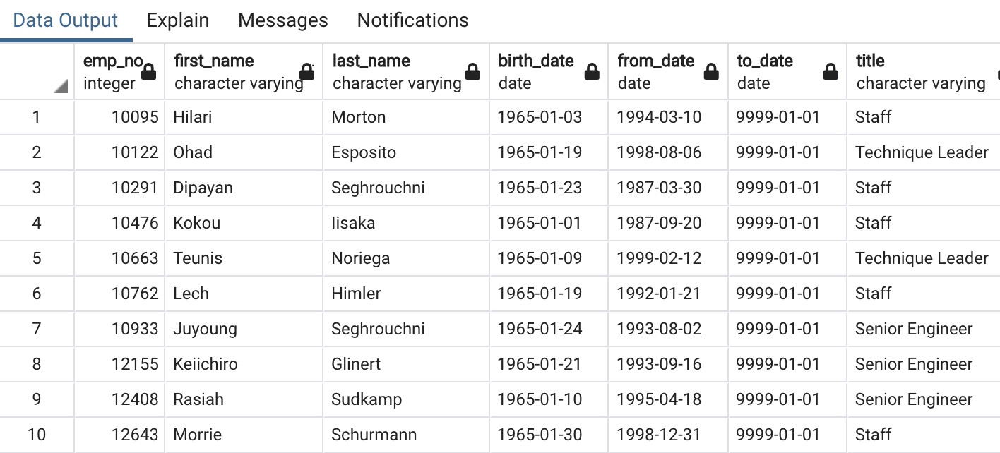

# PH-Analysis
## Overview

Employment at Pewlett Hackard is about to go through what has been identified as a "silver tsunami", meaning a large number of senior employees will retire soon, leaving their positions empty. HR has been tasked with finding the employees that will soon retire, as well as those who would be eligible for a mentorship program designed to coach more junior employees as they transition into the vacant roles.

## Results

All tables displayed (except for table 3) show only the first few records since it would be unproductive to show over 1000 rows in most cases.

- Table 1 shows the people who will retire, however, some of them have had different roles within the company and so their records might be duplicated and not accurate.

- Table 2 shows the latest and unique titles from the same individuals as Table 1.

- Table 3 shows the count of titles that will retire.

- Table 4 shows the employees who are eligible for the mentorship program.

## Summary

- How many roles will need to be filled as the "silver tsunami" begins to make an impact?

As shown in table 3: 90,398 roles must be filled, with Senior Engineer and Senior Staff making up most of the retiring employees.

- Are there enough qualified, retirement-ready employees in the departments to mentor the next gen of PH employees?

NO, there is a total of 1549 qualified employees for the program, for this idea to work each mentor would have to coach almost 60 employees, which is far from a part-time job. A different strategy should be made.
